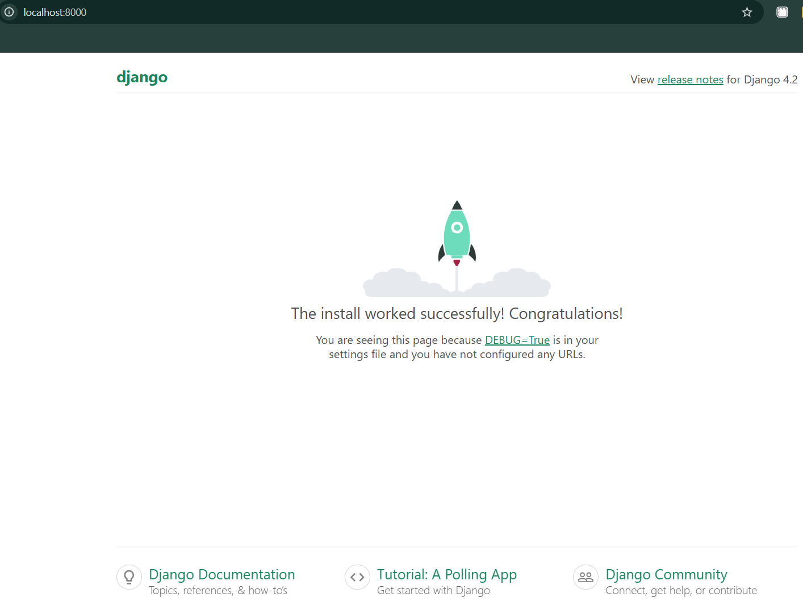

# My own microservice project
This is a repository for an educational project within the DevOps CI/CD course.

## Goal
Learn the basics of working with Git and GitHub.

### Docker app

Start the project using the command:

```bash
docker-compose up -d
```

