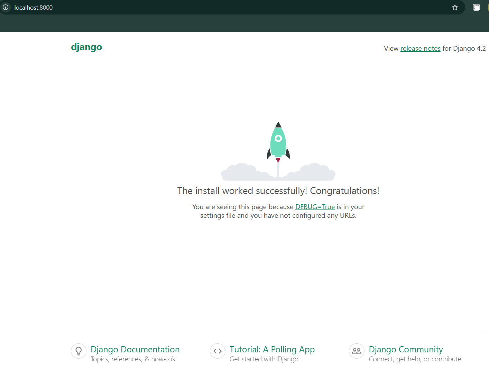
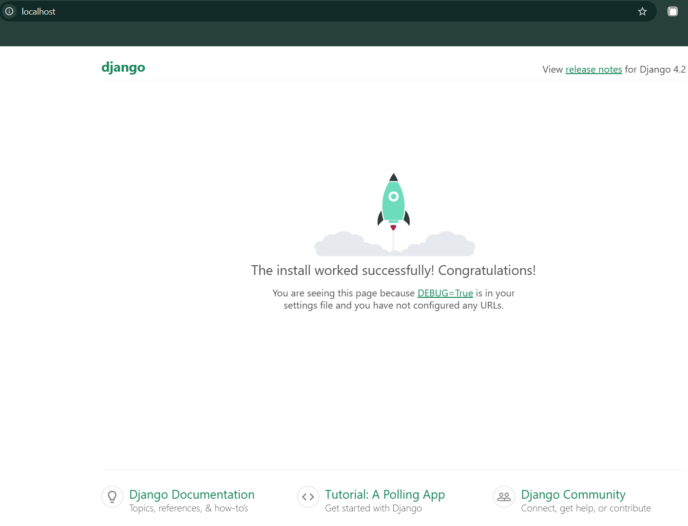

# My own microservice project
This is a repository for an educational project within the DevOps CI/CD course.

## [DevTools Setup Script](/install_dev_tools.sh)

This Bash script automates the installation and setup of a Python development environment with Docker, Docker Compose, and Django on Ubuntu-based systems. It also creates and activates a Python virtual environment.

### Features

- Installs essential packages: docker.io, docker-compose, python3, python3-venv, and python3-pip.
- Checks Python version and ensures Python 3.9 or newer is installed.
- Creates and activates a virtual environment (devtools_venv).
- Upgrades pip inside the virtual environment.
- Installs Django inside the virtual environment.
- Provides color-coded console messages for easy readability.

### Usage

Make the script executable:
```bash
chmod +x install_dev_tools.sh
```

Run the script:
```bash
./install_dev_tools.sh
```

Activate the virtual environment:
```bash
source devtools_venv/bin/activate
```

---

## [Django Project](/docker/)

This project is a Dockerized Django web application with PostgreSQL as the database and Nginx as a reverse proxy.

### Project Structure

```
docker/
├── django/
│ ├── goit/
│ ├── manage.py
│ ├── requirements.txt
│ └── Dockerfile
├── nginx/
│ └── nginx.conf
└── docker-compose.yml
```

### Setup Instructions

*Clone the repository:*
```bash
git clone https://github.com/Olesia2805/my-microservice-project.git
cd docker
```

*Create a .env file with the following variables:*
```
POSTGRES_DB=
POSTGRES_USER=
POSTGRES_PASSWORD=
POSTGRES_HOST=
POSTGRES_PORT=
```

*Build and start the containers:*
```bash
sudo docker-compose up -d --build
```

**Verify:**
- Django app: http://localhost:8000



- Nginx proxy: http://localhost



**Notes:**

- To stop the containers:
```bash
sudo docker-compose down
```
- To remove unused containers, volumes, and networks:
```bash
sudo docker system prune -f
```
