# My own microservice project
This is a repository for an educational project within the DevOps CI/CD course.

## [DevTools Setup Script](/install_dev_tools.sh)

This Bash script automates the installation and setup of a Python development environment with Docker, Docker Compose, and Django on Ubuntu-based systems. It also creates and activates a Python virtual environment.

### Features

- Installs essential packages: docker.io, docker-compose, python3, python3-venv, and python3-pip.
- Checks Python version and ensures Python 3.9 or newer is installed.
- Creates and activates a virtual environment (devtools_venv).
- Upgrades pip inside the virtual environment.
- Installs Django inside the virtual environment.
- Provides color-coded console messages for easy readability.

### Usage

Make the script executable:
```bash
chmod +x install_dev_tools.sh
```

Run the script:
```bash
./install_dev_tools.sh
```

Activate the virtual environment:
```bash
source devtools_venv/bin/activate
```

---

## [Django Project](/docker/)

This project is a Dockerized Django web application with PostgreSQL as the database and Nginx as a reverse proxy.

### Project Structure

```
docker/
├── django/
│ ├── goit/
│ ├── manage.py
│ ├── requirements.txt
│ └── Dockerfile
├── nginx/
│ └── nginx.conf
└── docker-compose.yml
```

### Setup Instructions

*Clone the repository:*
```bash
git clone https://github.com/Olesia2805/my-microservice-project.git
cd docker
```

*Create a .env file with the following variables:*
```
POSTGRES_DB=
POSTGRES_USER=
POSTGRES_PASSWORD=
POSTGRES_HOST=
POSTGRES_PORT=
```

*Build and start the containers:*
```bash
sudo docker-compose up -d --build
```

**Verify:**
- Django app: http://localhost:8000

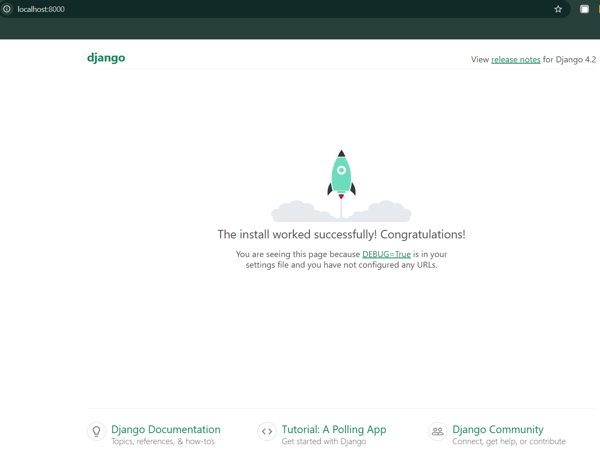

- Nginx proxy: http://localhost

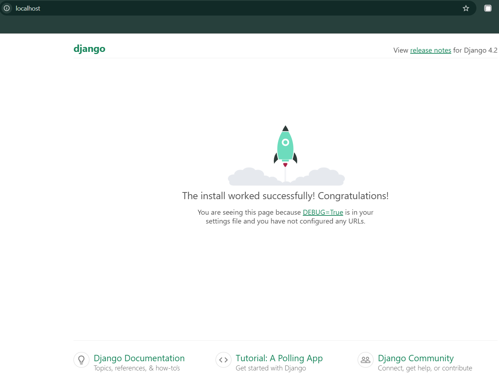

**Notes:**

- To stop the containers:
```bash
sudo docker-compose down
```
- To remove unused containers, volumes, and networks:
```bash
sudo docker system prune -f
```

## [Terraform HW5](/terraform-hw-5/)

Структура проєкту
```
terraform-hw-5/
│
├── main.tf                  # Головний файл для підключення модулів
├── backend.tf               # Налаштування бекенду для стейтів (S3 + DynamoDB)
├── outputs.tf               # Загальне виведення ресурсів
│
├── modules/                 # Каталог з усіма модулями
│   │
│   ├── s3-backend/          # Модуль для S3 та DynamoDB
│   │   ├── s3.tf            # Створення S3-бакета
│   │   ├── dynamodb.tf      # Створення DynamoDB
│   │   ├── variables.tf     # Змінні для S3
│   │   └── outputs.tf       # Виведення інформації про S3 та DynamoDB
│   │
│   ├── vpc/                 # Модуль для VPC
│   │   ├── vpc.tf           # Створення VPC, підмереж, Internet Gateway
│   │   ├── routes.tf        # Налаштування маршрутизації
│   │   ├── variables.tf     # Змінні для VPC
│   │   └── outputs.tf       # Виведення інформації про VPC
│   │
│   └── ecr/                 # Модуль для ECR
│       ├── ecr.tf           # Створення ECR репозиторію
│       ├── variables.tf     # Змінні для ECR
│       └── outputs.tf       # Виведення URL репозиторію ECR
│
└── README.md                # Документація проєкту
```

### Схема взаємодії модулів

```
                ┌───────────────┐
                │   Terraform   │
                │   main.tf     │
                └──────┬────────┘
                       │
    ┌──────────────────┼─────────────────────┐
    │                  │                     │
┌───▼───┐          ┌───▼───┐             ┌───▼───┐
│s3-    │          │ vpc   │             │ ecr   │
│backend│          │module │             │module │
└───┬───┘          └───┬───┘             └───┬───┘
    │                  │                     │
    │                  │                     │
    │                  │                     │
┌───▼───────────────┐ ┌▼──────────────────┐ ┌▼──────────────┐
│ S3 Bucket         │ │ VPC               │ │ ECR Repo      │
│ terraform.tfstate │ │ ├─ Public Subnets │ │ Images        │
│ Versioning        │ │ ├─ Private Subnets│ │ Scan on Push  │
│ Ownership         │ │ └─ Internet GW    │ │ Tags          │
│ DynamoDB          │ │ Routing Tables    │ └───────────────┘
└───────────────────┘ └───────────────────┘

```

**Пояснення:**
- `main.tf` викликає всі модулі (`s3-backend`, `vpc`, `ecr`) та координує створення інфраструктури.
- **S3-backend**
   - Створює S3-бакет для зберігання `terraform.tfstate`.
   - Включає версіонування файлів для можливості відновлення стану.
   - Налаштовує власність об’єктів (BucketOwnerEnforced) для безпечного доступу.
   - Створює DynamoDB таблицю для блокування стану (locking).
- **VPC**
   - Створює ізольовану VPC мережу.
   - Створює публічні та приватні підмережі у вказаних Availability Zones.
   - Додає Internet Gateway для виходу публічних підмереж в Інтернет.
   - Налаштовує маршрутизацію між підмережами.
- **ECR**
   - Створює ECR репозиторій для зберігання Docker образів.
   - Налаштовує сканування образів при пуші на наявність вразливостей.
   - Додає теги для середовища та назви репозиторію.

### Приклад використання Terraform

- Terraform init
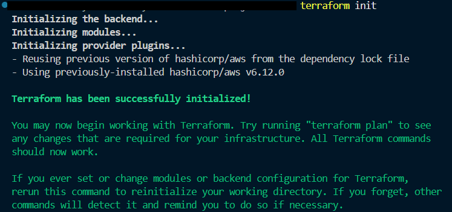

- Terraform plan
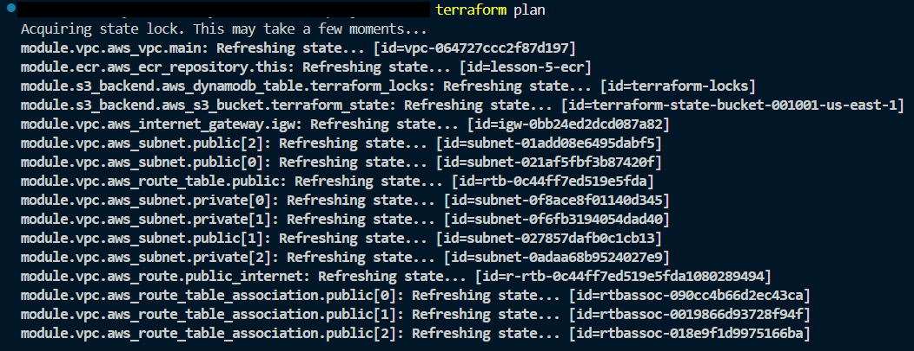

- Terraform apply
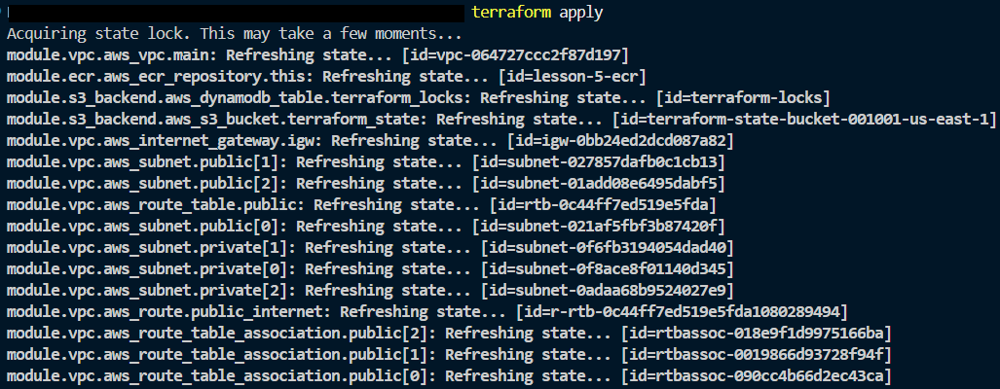
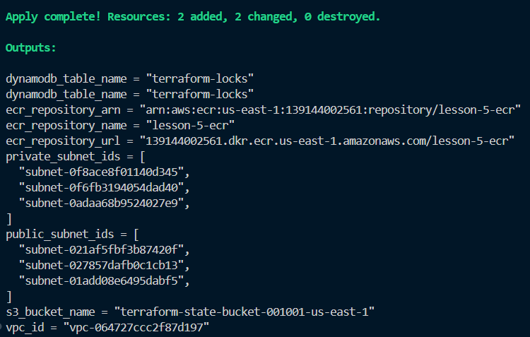

- Terraform destroy
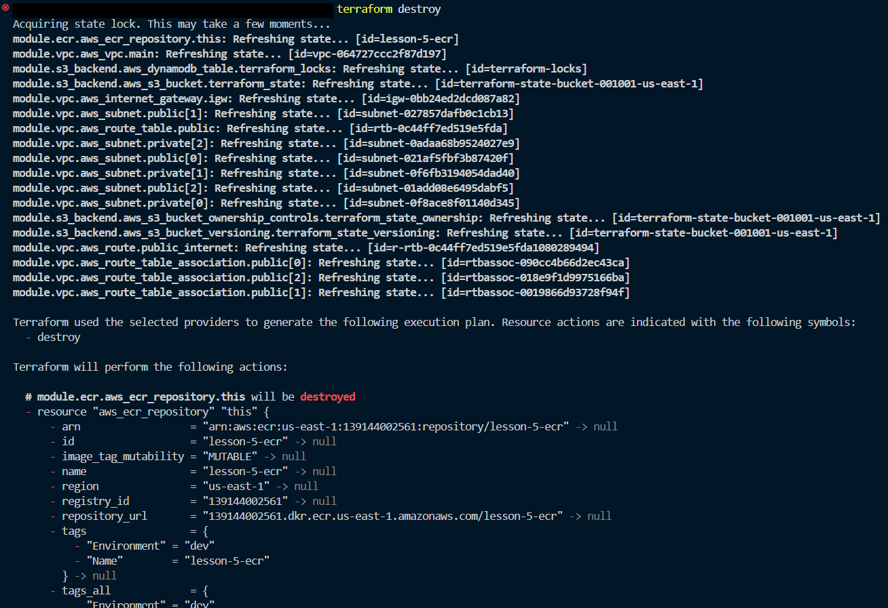

---

# [Terraform HW7](/terraform-hw-7/)

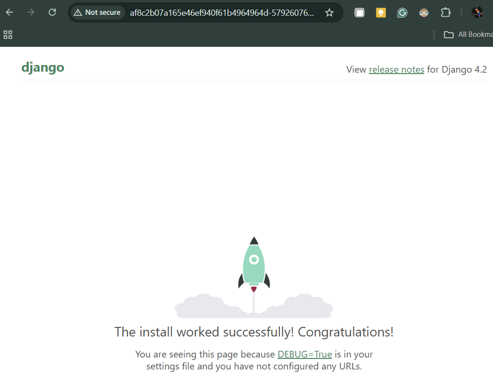

## Структура проєкту

```
lesson-7/
│
├── main.tf                  # Головний файл для підключення модулів
├── backend.tf               # Налаштування бекенду для стейтів (S3 + DynamoDB)
├── outputs.tf               # Загальні виводи ресурсів
│
├── modules/                 # Каталог з усіма модулями
│   ├── s3-backend/          # Модуль для S3 та DynamoDB
│   ├── vpc/                 # Модуль для VPC
│   ├── ecr/                 # Модуль для ECR
│   └── eks/                 # Модуль для Kubernetes кластера
│
├── charts/
│   └── django-app/
│       ├── templates/
│       │   ├── deployment.yaml
│       │   ├── service.yaml
│       │   ├── configmap.yaml
│       │   └── hpa.yaml
│       ├── Chart.yaml
│       └── values.yaml     # ConfigMap зі змінними середовища
│
└── README.md                # Документація проєкту
```

---

## Покрокова інструкція для деплойменту Django на EKS

### Підготовка Docker-образу

1. Перейти в каталог проєкту:

2. Побудувати Docker-образ:

```powershell
docker build -t lesson-7-ecr .
```

3. Логін в ECR:

```powershell
aws ecr get-login-password --region us-east-1 | docker login --username AWS --password-stdin <account_id>.dkr.ecr.us-east-1.amazonaws.com
```

4. Позначити образ тегом ECR та запушити:

```powershell
docker tag lesson-7-ecr:latest <account_id>.dkr.ecr.us-east-1.amazonaws.com/lesson-7-ecr:latest
docker push <account_id>.dkr.ecr.us-east-1.amazonaws.com/lesson-7-ecr:latest
```

### Зміни в Django settings

1. Відкрити `goit/settings.py`.
2. Замінити підключення до PostgreSQL на SQLite:

```python
DATABASES = {
    'default': {
        'ENGINE': 'django.db.backends.sqlite3',
        'NAME': BASE_DIR / 'db.sqlite3',
    }
}
```

3. Додати `ALLOWED_HOSTS`:

```python
ALLOWED_HOSTS = ["*"]
```

### Підготовка Kubernetes ресурсів

### Застосування ресурсів в Kubernetes

1. Застосувати ConfigMap:

```powershell
kubectl apply -f .\charts\django-app\templates\configmap.yaml -n lesson-7
```

2. Застосувати Deployment:

```powershell
kubectl apply -f .\charts\django-app\templates\deployment.yaml -n lesson-7
```

3. Перезапустити Deployment:

```powershell
kubectl rollout restart deployment lesson-7-django -n lesson-7
```

4. Застосувати Service:

```powershell
kubectl apply -f .\charts\django-app\templates\service.yaml -n lesson-7
```

### Перевірка роботи

1. Перевірити статус подів:

```powershell
kubectl get pods -n lesson-7
```

2. Переглянути логи:

```powershell
kubectl logs -n lesson-7 -l app=lesson-7-django
```

3. Отримати зовнішній IP сервісу:

```powershell
kubectl get svc -n lesson-7
```

4. Відкрити у браузері:

```
http://<EXTERNAL-IP>
```

Ось структурований та повний README для твого проекту, оформлений під критерії оцінювання CI/CD завдання:

---
-
# [Terraform HW8-9 — CI/CD для Django з Jenkins, Helm, Terraform та Argo CD](/terraform-hw-8-9/)

Цей проект демонструє повний CI/CD процес для Django-застосунку, який автоматично збирає Docker-образ, пушить його в Amazon ECR та розгортає в Kubernetes через Argo CD із Helm.

---

## 1️⃣ Підготовка інфраструктури з Terraform

1. Ініціалізація та застосування конфігурації Terraform:

```bash
terraform init -reconfigure
terraform plan
terraform apply
terraform state list
```

2. Імпорт існуючих ресурсів у Terraform state:

```bash
terraform import module.eks.aws_iam_role.eks eks-cluster-demo-eks-cluster
terraform import module.eks.aws_iam_role.eks_nodes eks-cluster-demo-nodes-role
terraform import module.s3_backend.aws_s3_bucket.terraform_state terraform-state-bucket-001001-us-east-1
terraform import module.s3_backend.aws_dynamodb_table.terraform_locks terraform-locks
terraform import module.vpc.aws_vpc.main vpc-0abcd1234ef567890
terraform import module.vpc.aws_subnet.public[0] subnet-0abc123def456gh78
terraform import module.vpc.aws_subnet.private[0] subnet-0def456abc789gh12
terraform import module.eks.aws_eks_cluster.cluster eks-cluster-demo
terraform import module.eks.aws_eks_node_group.nodes eks-cluster-demo-nodegroup
```

3. Перевірка доступних вузлів Kubernetes:

```bash
kubectl get nodes
```

---

## 2️⃣ Робота з Docker та Amazon ECR

1. Логін у ECR:

```powershell
$pass = aws ecr get-login-password --region us-east-1
docker login --username AWS --password $pass <account_id>.dkr.ecr.us-east-1.amazonaws.com
```

2. Перевірка наявності репозиторію:

```bash
aws ecr describe-repositories --repository-names lesson-8-9-ecr
```

3. Збірка та пуш Docker-образу:

```bash
docker build -t lesson-8-9-ecr:latest -f docker/django/Dockerfile .
docker tag lesson-8-9-ecr:latest <account_id>.dkr.ecr.us-east-1.amazonaws.com/lesson-8-9-ecr:latest
docker push <account_id>.dkr.ecr.us-east-1.amazonaws.com/lesson-8-9-ecr:latest
```

4. Перевірка образів у репозиторії:

```bash
aws ecr list-images --repository-name lesson-8-9-ecr
```

---

## 3️⃣ Налаштування Argo CD

1. Перевірка статусу namespace та Argo CD:

```bash
kubectl get ns
kubectl get pods -n argo-cd
kubectl get svc -n argo-cd
```

2. Порт-форвардинг Argo CD для доступу через браузер:

```bash
kubectl port-forward svc/argo-cd-argocd-server -n argo-cd 8080:443
```

Відкриваємо у браузері: [https://localhost:8080/](https://localhost:8080/)

3. Отримання початкового пароля адміністратора:

```powershell
$pass = kubectl get secret argocd-initial-admin-secret -n argo-cd -o jsonpath="{.data.password}"
[System.Text.Encoding]::UTF8.GetString([System.Convert]::FromBase64String($pass))
```

4. Логін у CLI Argo CD:

```powershell
argocd login localhost:8081 --username admin --password $pass --insecure
```

---

## 4️⃣ Робота з Helm та Django застосунком

1. Перехід у каталог Helm-чарту:

```bash
cd charts/django-app
```

2. Перегляд шаблонів Helm:

```bash
helm template myapp . `
  --set image.repository=<account_id>.dkr.ecr.us-east-1.amazonaws.com/lesson-8-9-ecr `
  --set image.tag=latest
```

3. Створення namespace для Django:

```bash
kubectl create namespace django
```

4. Застосування Argo CD Application:

```bash
kubectl apply -f modules/argo_cd/charts/templates/application.yaml -n argo-cd
```

5. Перевірка розгортання:

```bash
kubectl get pods -n django
kubectl get svc -n django
```

---

## 5️⃣ Скріншоти

* Jenkins:
  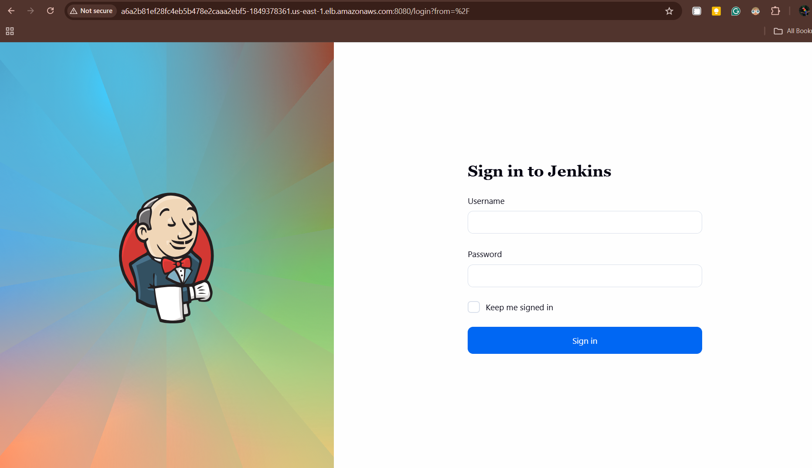

* Argo CD:
  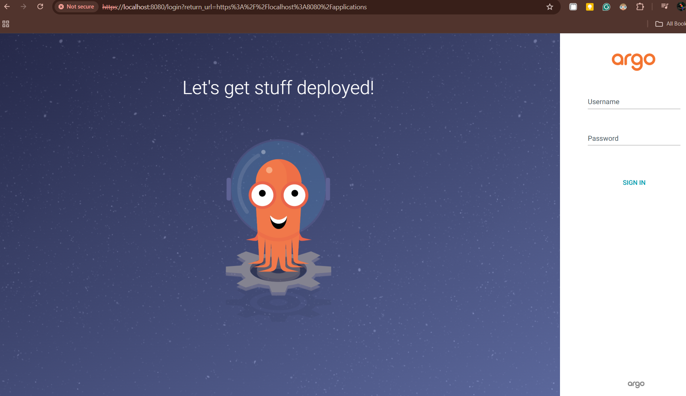

* Django застосунок розгорнуто:
  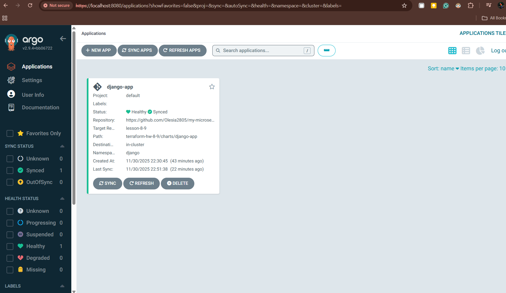

# [Terraform HW10](/terraform-hw-10/)

* use_aurora = false
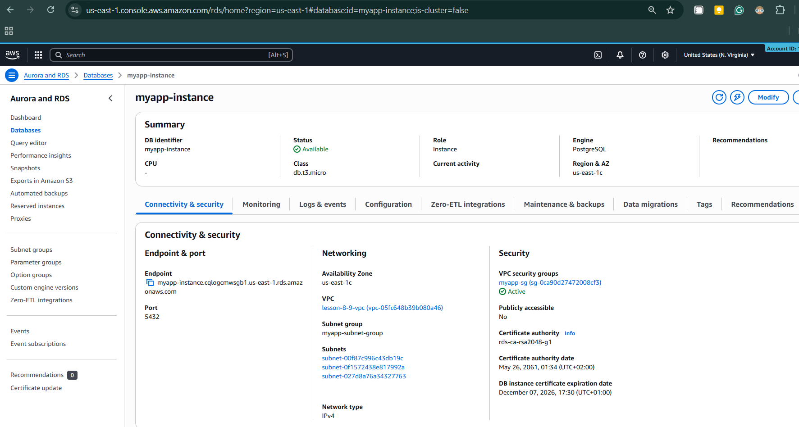

* use_aurora = true
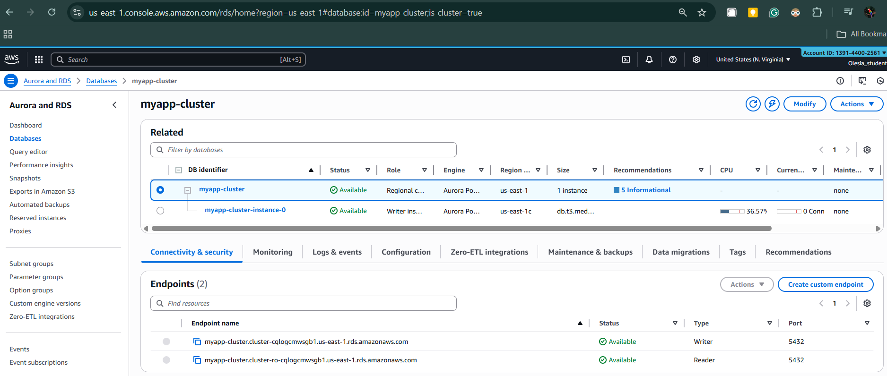

---

# [Terraform Final Project](/final-project/)

Grafana:
kubectl port-forward svc/grafana 3000:80 -n monitoring


Prometheus:
kubectl port-forward svc/monitoring-kube-prometheus-prometheus 9090:9090 -n monitoring


kubectl get all -n jenkins


kubectl get all -n argo-cd


kubectl get all -n monitoring
